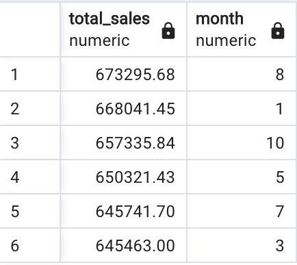
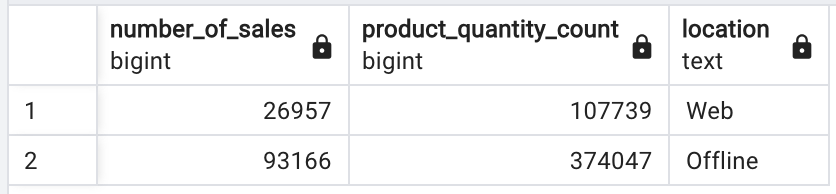

# Multinational Retail Centralisation
Collating and cleaning data owned by a fictional multinational corporation in a PostgreSQL RDBMS. Querying and returning insights from the resultant database.


# Description

This project centralises disparate datasets for use in a RDBMS for faster and easier querying using PostgreSQL. It contains some example queries to demonstrate the ease and power of SQL querying techniques. 

# Usage

The datasets used to construct the database tables were stored in many different locations. This lead to several extraction techniques being deployed in methods in a DataExtractor class (see the data_extraction.py file in this repository). These methods primarily made use of AWS Boto3, the Requests library and Tabula-Py (a python version of a Java library which converts tabula data in .pdf files into a form readable by Pandas). To improve modularity and maintainability, the extracted datasets were cleaned using a separate data_cleaning.py file containing a DataCleaner class with separate methods for cleaning each dataset. The cleaning was performed in Pandas and Numpy. Finally, downloads from any existing databases used in the extraction stage and uploads to the new database were handled by a databas_utils.py file containing a DatabaseConnector class. 

Once the data was extracted, cleaned and uploaded to a database, the database was schematised. A star schema was adopted. The schema design can be found in the db_schema.sql file included in this repository or viewed in graphical form in the header of this README file. 

Once schematised, the database was queried. This yielded a number of insights (to reproduce these results see the attached .sql script queries.sql contained in this repository). 

For instance, the queries quickly revealed the top 6 months for sales, differences in sales figures between online and physical outlets and the total sales/percentages of sales for each type of store (amongst other things - again - see comments in the included queries.sql file for further examples).

### Top 6 months for sales:



### Sales counts and products counts by online and physical:



### Total sales and percentages by store type:


The resultant database centralises the company's data and optomises it for querying. Such queries may then be exported for further analysis using other programmatic data manipulation tools e.g. python pandas, or visualised using e.g. Seaborn, Plotly, PowerBI or Tableau.  

# Installation

To install the files from this repository, run:

```
git clone https://github.com/WillEckersley/Multinational_retail_centralisation/tree/main
```

Then, to install dependencies, run:

```
pip install -r requirements.txt
```

Finally, to execute the upload of the datasets to the database, run:

```
python main.py
```

(Note: to reproduce the database natively, a different .yaml file will need to be read into the read_db_creds method in database_utils.py).

# Teachnologies used

### Principal:

- Python
- Pandas
- PostgreSQL

### Ancilliary:

- Sqlalchemy
- Psycopg2
- Numpy
- AWS Boto3
- re
- dateutil.parser
- json
- Requests
- tabula-py
- yaml

# License

Licensed under the Unlicense. 