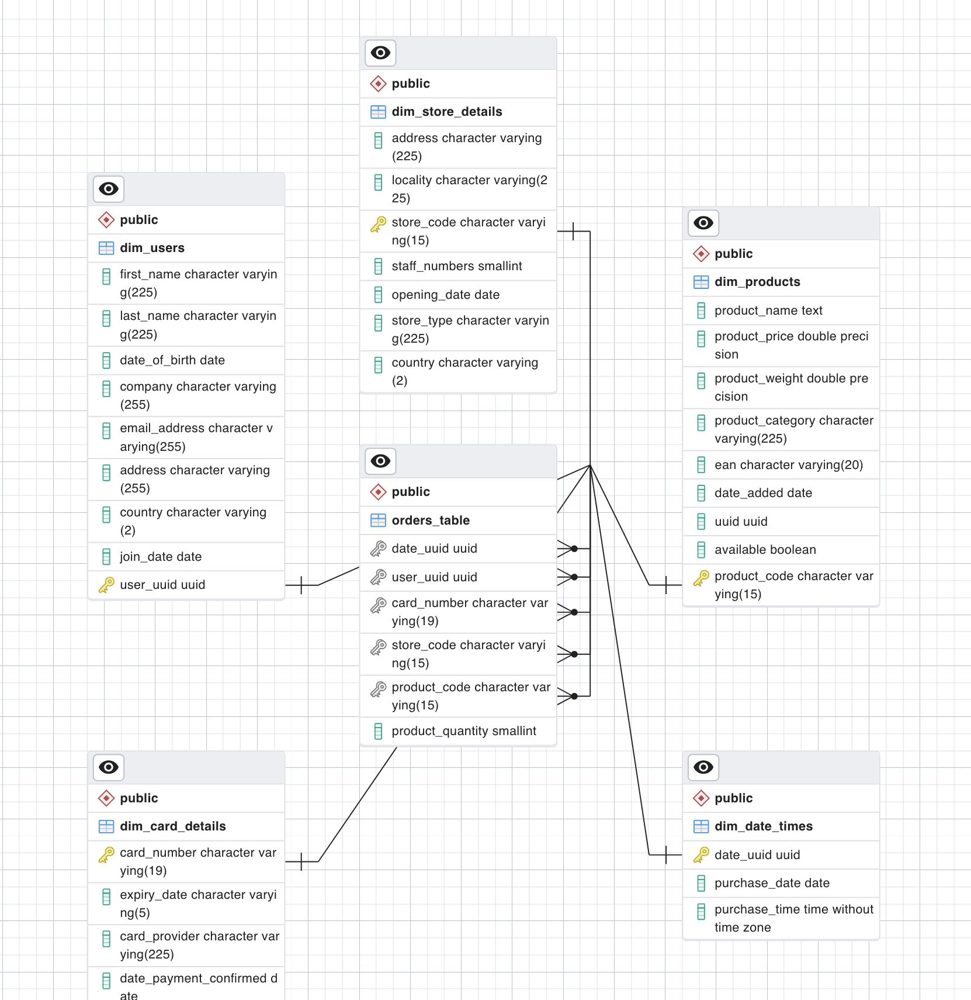

# Multinational Retail Centralisation
Collating and cleaning data owned by a fictional multinational corporation in a PostgreSQL RDBMS. Querying and returning insights from the resultant database.

# Description

This project aims to centralise disperate datasets for use in a RDBMS for faster and easier querying useing PostgreSQL. As the datasets used to construct the database tables were stored in many different locations, several extraction techniques were deployed. These included the use of AWS Boto3, the Requests library and the PyTabula library (a special python version of a Java library which converts tabula data in .pdf files into a form readable by Pandas). To ensure modularity and maintainabilty, the extracted datasets were cleaned using a seperate data_cleaning.py file containing a DataCleaner class with seperate methods for cleaning each dataset. The cleaning was performed in Pandas and Numpy. Finally, downloads from an existing database and uploads to the new database were handled by the a databas_utils.py file containing a DatabaseConnector class. 

Once the data was extracted, cleaned and uploaded to a database, the database was schematised and queried. 

Further details of the schema design can be found in the db_schema.sql file included in this repository. 

A number of insights were gained from the querying process (to reproduce these results see the attached .sql script queries.sql contained in this repository). For instance, the queries quickly revealed the top 6 months for sales, diffences in sales figures between online and physical outlets and the total sales/percentages of sales for each type of store (amongst other things - see queries.sql comments for further examples).